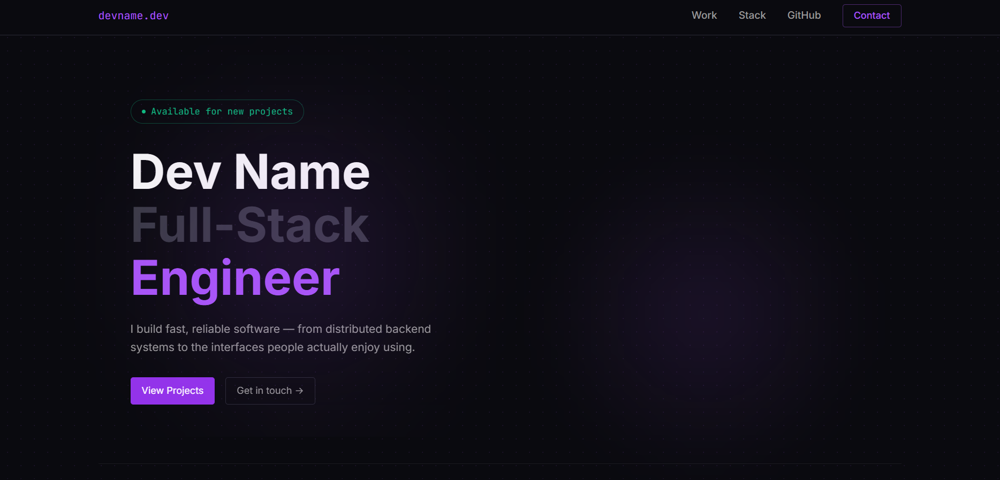

# Developer Portfolio: Practice Project

A dark-themed, developer-focused portfolio landing page built from scratch with plain **HTML, CSS, and JavaScript**, with no frameworks and no build tools. Built as a frontend practice project to recreate a Figma Make design pixel-by-pixel while learning the "why" behind every line of code.

**Live demo:** https://kcmacapayad-portfolio-layout.vercel.app/



## About this project

This is a **template/practice layout**. All content (name, projects, stats, GitHub activity) is placeholder data, not a real person's information.

It's one of several front-end practice projects I've built to sharpen my skills translating Figma designs into clean, responsive code, a workflow I've used on a couple of other projects too, including [FORMA](https://forma-web-layout.vercel.app/), a one-page layout built from a Figma AI mockup, and [Expeculiart](https://expeculiart.vercel.app/), a full rebuild of an earlier site I made back in college. This one pushed me further into things like CSS Grid heatmaps, `IntersectionObserver`, and responsive breakpoints down to very small screen widths.

You can see more of my work at [my portfolio](https://kcmacapayad-portfolio.vercel.app/) or [GitHub](https://github.com/kimcarlmc).

While building this, I focused on:

- Semantic HTML structure
- Modern CSS (custom properties, Grid, Flexbox, media queries)
- Vanilla JavaScript (DOM manipulation, event listeners, Intersection Observer)
- Responsive design across desktop, tablet, and mobile
- SEO fundamentals (meta tags, Open Graph, Twitter Cards)

## Features

- **Dark, terminal-inspired design** with a dotted grid background and soft purple glow accents
- **Mouse-following spotlight glow** that trails the cursor
- **GitHub-style contribution heatmap**, dynamically generated with JavaScript
- **Fully responsive**: includes a hamburger menu with slide-down mobile navigation, tested down to 280px-wide screens
- **Smooth-scroll navigation** to page sections
- **SEO-ready**: meta description, Open Graph tags, and Twitter Card tags for clean link previews on social platforms

## Sections

1. **Navbar**: sticky header with logo, nav links, and a responsive mobile menu
2. **Hero**: name, role, tagline, and call-to-action buttons
3. **Stats**: years of experience, projects shipped, GitHub stars
4. **Tech Stack**: a wrapped grid of technology badges
5. **Selected Work**: three project cards with status badges, descriptions, and tags
6. **GitHub Activity**: a generated contribution heatmap with streak stats
7. **CTA Banner**: a closing call-to-action
8. **Footer**: social links and site credits

## Tech stack

| Layer | Choice |
|---|---|
| Structure | Semantic HTML5 |
| Styling | CSS3 (custom properties, Grid, Flexbox, media queries) |
| Interactivity | Vanilla JavaScript (ES6+) |
| Fonts | [Inter](https://fonts.google.com/specimen/Inter) (UI text) + [JetBrains Mono](https://fonts.google.com/specimen/JetBrains+Mono) (labels, badges, stats) |
| Hosting | [Vercel](https://vercel.com) |

## Running locally

No build step required. It's plain HTML/CSS/JS.

1. Clone or download this repository
2. Open `index.html` directly in a browser, **or**
3. Serve it locally with any static server, e.g.:
   ```bash
   npx serve .
   ```

## Project structure

```
├── index.html      # Page structure and content
├── style.css       # All styling, including responsive breakpoints
├── script.js       # Mouse glow, heatmap generation, mobile menu, smooth scroll
└── public/
    └── favicon.ico
    └── portfolio-layout-mockup.png
```

## Known limitations

- All project data, GitHub stats, and contribution activity are static placeholders, not pulled from a real API
- Social/contact links point to `#` placeholders

## Author

**Kim Carl Macapayad**, Computer Engineering graduate, front-end developer in progress.
[Portfolio](https://kcmacapayad-portfolio.vercel.app/) · [GitHub](https://github.com/kimcarlmc) · [LinkedIn](https://www.linkedin.com/in/kim-carl-u-macapayad-432185373/)

Design reference: a Figma Make "Developer Portfolio Landing Page" template.
